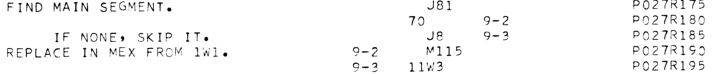
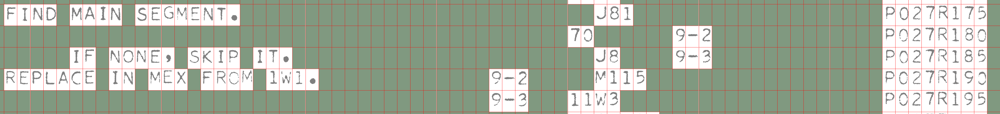

# Gridlock Code Extraction

There are a large number of computer programs of historical value
where the only version remaining is a line printer listing scanned
into a PDF. The code is often in uncommon languages and has particular
format requirements, such as column positioning. 

Often researchers want to extract the text, for analysis or to get it
running again, but existing techniques to extract source code text are
not ideal. Traditional OCR (optical character recognition) systems do
a poor job at positioning characters correctly on the page, and often
stumble at accurately extracting computer code as they are trained on
prose. You can always manually read the code and type it in again, but
bitter experience shows that this is a tedious job and you will make
many typos.

Gridlock is an attempt to address this, combining a grid
[segmenter]((https://gtoal.com/src/OCR/README-OCR.html)) with LLM
(Large Language Model) OCR techniques to produce a fast and quite
accurate result. The system uses the Google [Gemini 2.5
Pro](https://aistudio.google.com/) model right now, but with some
coding it should work with other LLMs.

## How it works

There are essentially three stages: preparation, analysis and merging.

In the first stage, we break down the PDF into individual pages,
convert to PNG images, crop out unnecessary regions and remove skew
from the image. This is mostly automated, controlled by a config file
where you provide details such as what page to start from in the PDF.

The analysis stage looks at each page image and produces two items for
each, a template and a text. Let's look at an example. Say we have a
page image that looks like this:



The template is formed by finding the best fit for a grid that
separates each character, and then classifying each square as either a
character or whitespace. This will handle minor distortions in the
image quite well. 



This is transformed into a text file where `#` denotes a character.

```
     #### #### ########                           ###                   ########
                                                ##      ###             ########
          ## ##### #### ###                       ##    ###             ########
     ####### ## ### #### ####             ###     ####                  ########
                                          ###   ####                    ########
```

For the second item, we take the page image and send it to a LLM, with
a prompt asking it to extract the page text and preserve whitespace.
We get output like this.

```
FIND MAIN SEGMENT.                                                 
                                   J81                             P027R175
IF NONE, SKIP IT.                  70                              P027R180
                                   J8                              P027R185
REPLACE IN MEX FROM 1W1.     9-2   M115            9-2             P027R190
                             9-3   11W3            9-3             P027R195
```

Note that the character recognition is quite good, but the character
positioning is not. The horizontal positioning is not right for the
middle three columns, and also note that the left hand column has
different vertical spacing from the original and the rest of the text.

The final stage is to merge the template and text to form the output.
This is where some manual intervention is needed. The system will try
to break the template and text into similar columns and then fill text
into the template from top left to bottom right, word by word,
preserving the whitespace in the template, until all characters are
consumed It is usually necessary to make some small edits to both
template and text to get the algorithm to complete the match. The
final output looks like this:

```
     FIND MAIN SEGMENT.                           J81                   P027R175
                                                70      9-2             P027R180
          IF NONE, SKIP IT.                       J8    9-3             P027R185
     REPLACE IN MEX FROM 1W1.             9-2     M115                  P027R190
                                          9-3   11W3                    P027R195
```

This is then repeated for each page, and all pages are concatenated to
produce a single text file.

## Evaluation

As a test, in August 2025 I ran Gridlock on a PDF where manual text
extraction had been done previously and the code had been checked by
executing it.

* 7 pages were run through the system
* It took around 30 minutes to complete the process
* It cost $0.66 in LLM API calls
* It was 100% accurate on character placement
* It was 99.84% accurate on character recognition, getting 51 characters wrong out of a total of 32643

There are some downsides

* Most of the misrecognised characters were the usual problems you get
  with OCR, such as mistaking `0` for `O`. But four were more subtle
  hallucinations that were harder to spot. Combining the grid with the
  LLM text grounds the model on reality and takes care of most issues,
  but the indeterminate nature of LLM output makes it hard to fully trust.
* There is a cost per page of 9.5c, and the cost may vary as models
  change.
* This is not a turn-key system - most of the 30 minutes were spent
  making manual edits to the text and template files to help the
  system match them.

Full details are [here](./tutorial/README.md), which is also a tutorial
on how to use Gridlock.

## Alternatives

Gridlock is a hybrid solution that is most useful for code print outs
where horizontal and vertical positioning is important. You may find
the underlying methods more suitable for your needs

* Graham Toal's [OCR
  system](https://gtoal.com/src/OCR/README-OCR.html) was the
  inspiration for this system and we use part of its code as a
  dependency. Graham's system segments a page to a grid but unlike
  Gridlock it then trains a model on the font used to recognise
  characters locally. This works well on printouts with minimal
  distortions and when set up can produce results for large printouts
  quickly.
* Modern LLMs are very good at text recognition, even compared to six
  months ago. Try uploading a page from your printout and asking it to
  extract text - you may get good enough results to not need Gridlock.

## Prerequisite

As each page is considered independently, Gridlock uses GNU Parallel
to run jobs in parallel to save time, so a multi-core machine would be
useful. None of the jobs are particularly CPU-intensive, however.

You will need a Unix-like environment with a shell and Python 3. You
should install the following which are probably available from your
package manager.

* GNU Parallel
* Imagemagick
* `pdfimages` from the Poppler utilities (`poppler-utils` on Debian,
  `poppler` on MacOS homebrew).
  
You will also need to locally compile the following programs which are
likely not in your package manager

* [Graham Toal's OCR
  system](https://gtoal.com/src/OCR/README-OCR.html) - you just need
  to compile the `segmenter` directory
* [Marek Mauder's deskew](https://galfar.vevb.net/wp/projects/deskew/)
  version 1.30 - the precompiled binaries in the archive should work fine.
  
(These can live in their own directory and don't need to be installed
system wide; in a set up step later you can add them to your path).

You should also have a good text editor at hand as you will need to do
tasks like copy and paste rectangles of text or separate two columns
in a page by adding spaces.

Finally, you will need an API key for Gemini. The system could work
with any LLM provider (I have done some manual tests using Claude) but
there is only code for Gemini right now (patches for other systems
welcome). Got to [AI Studio](https://aistudio.google.com/) and sign up
for an API key. *You will need to use the Pro models so will have to
provide a credit card*. First time users can get credits from Google
Cloud which will cover the costs for many pages, however.

## Set up

This needs to be performed once only.

* Clone the code
* In the cloned directory, make a virtual environment and install dependencies

```
python3 -m venv .venv
source .venv/bin/activate
python3 -m pip install -r requirements.txt
```

* Edit `gridlock.env` and add any non-system wide dependencies like
deskew to your path there. Also change the line starting `export
GRIDLOCK=` to point to the directory you extracted the code to.

## Usage

I suggest you look at the [tutorial](./tutorial/README.md) to learn how to
use the system before embarking on a bigger project.

Each code extraction project you do should live in its own directory.
The general workflow is to run each of these commands:

* `gridlock new` - create new project directory
* `gridlock split` - split PDF file to images
* `gridlock crop` - crop page images to include only useful text
* `gridlock straighten` - remove skew from page images
* `gridlock segment` - find the best grid that matches page images
* `gridlock templates` - create templates from segmented pages
* `gridlock text` - use a LLM to get text from a page image
* `gridlock merge` - combine the template and text
* `gridlock collect` - assemble merged pages into a single file

The individual commands are documented in [COMMANDS.md](./COMMANDS.md).

## License

Copyright 2025 Rupert Lane

GPL v3; see [COPYING.md](./COPYING.md)

This program is free software: you can redistribute it and/or modify
it under the terms of the GNU General Public License as published by
the Free Software Foundation, either version 3 of the License, or (at
your option) any later version.

This program is distributed in the hope that it will be useful, but
WITHOUT ANY WARRANTY; without even the implied warranty of
MERCHANTABILITY or FITNESS FOR A PARTICULAR PURPOSE. See the GNU
General Public License for more details.

You should have received a copy of the GNU General Public License
along with this program. If not, see <https://www.gnu.org/licenses/>.

## Support

You are free to use this program as per the terms of the above
license. I welcome relevant bug fixes and pull requests, and will try
to answer any questions you have. However, I cannot commit to
providing detailed support, adding features or doing your OCR project
for free.

If you have extracted some interesting code using this project, please
send me a link and I will add it here.

For any communication, use the Github issue system or email
rupert@timereshared.com

## Software extracted using this project

* [IPL-V listings](https://github.com/rupertl/iplv-listings)
