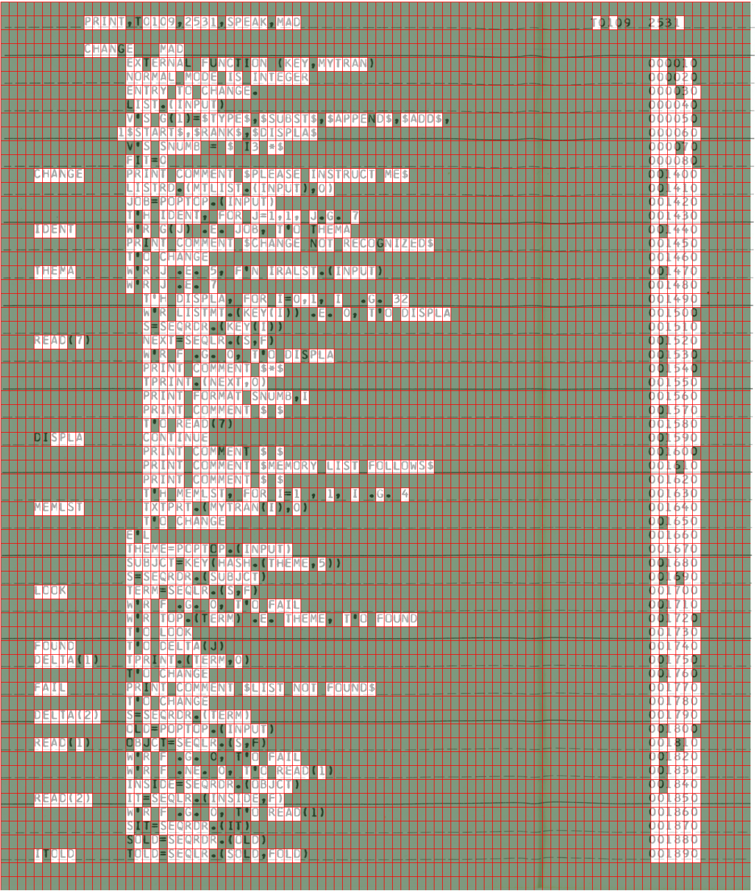
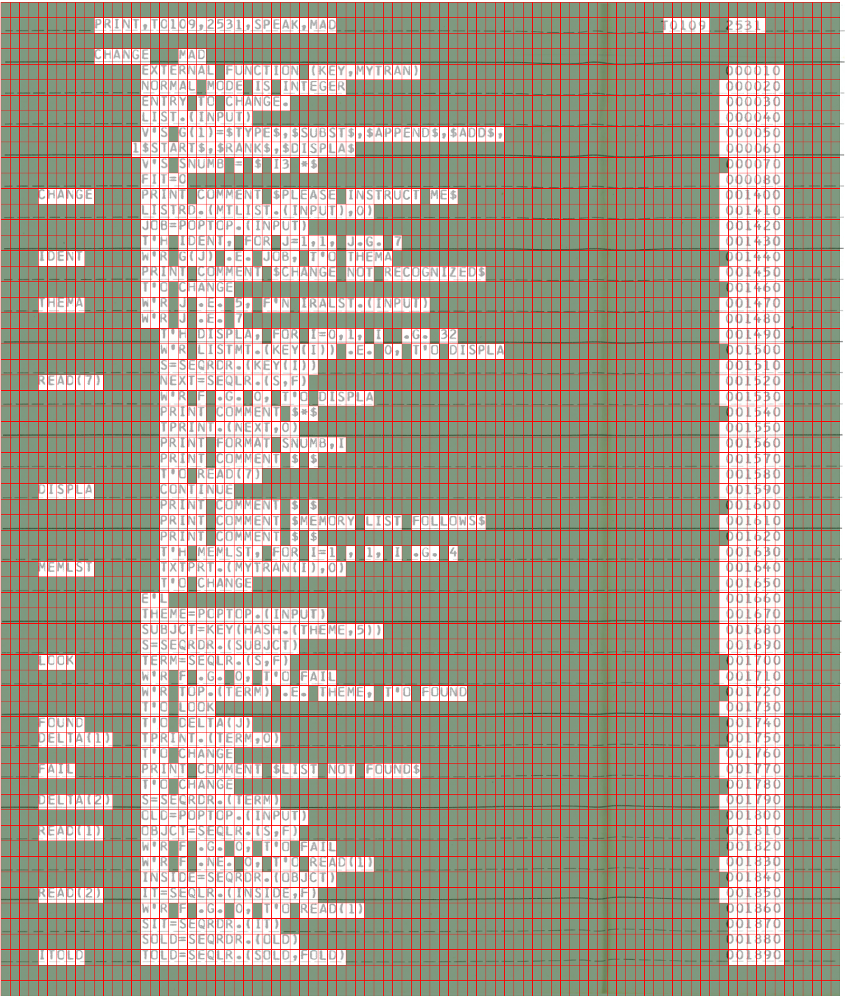

This is a tutorial and evaluation for Gridlock that uses the 
[original 1965 source code for ELIZA](https://github.com/jeffshrager/elizagen.org/tree/master/1965_Weizenbaum_MAD-SLIP)
as an input. This was chosen because a group of volunteers had already
manually extracted text from it and then 
[got it to compile](https://github.com/rupertl/eliza-ctss) on an
emulator, so we have a good baseline to compare to.

Before you begin, make sure you have followed the prerequisite steps
in the README to install dependencies, set up your LLM API key and
build the virtual env.

## Set up the project

Create a new project directory (replace `/path/to/directory` with
whatever directory you have cloned the source of gridlock to, and make
the new directory somewhere outside of this source tree).

```
$ /path/to/gridlock/gridlock new ./ELIZA
```

Change to the directory and source in the env file

```
$ cd ELIZA
$ source gridlock.env
```

Remember to set your API key that you got earlier (replace `XXXX` below)

```
$ export GEMINI_API_KEY=XXXX
```

Fetch the ELIZA PDF

```
$ wget "https://github.com/jeffshrager/elizagen.org/blob/master/1965_Weizenbaum_MAD-SLIP/ORIGINAL_ELIZA_IN_MAD_SLIP_CC0_For_Resease.pdf?raw=true"
```

Rename it to something shorter.

```
mv OR* eliza.pdf
```

## Extract PDF to page images

Edit the config file `config.yaml` and change the `split` section to
look like the below. We will only consider the source code on pages
6-12 here.

```
split:
  input: "eliza.pdf"
  prefix: "ELIZA"
  first_page: 6
  last_page: 12
```

Run `gridlock split` to extract the pages to individual PNG files.
This took around 30s on my PC

```
$ gridlock split
Splitting 7 pages (single threaded, may take some time)
Incorrect number of split pages was 14 expecting 7
```

The error message is because the PDF contains two images per page: if
you look at the files in `split/` you will see that the odd numbered
files like `split/ELIZA-001.png` are empty and the even numbered files
like `split/ELIZA-000.png` have the code.

Remove the odd numbered files

```
$ rm split/ELIZA-0*[13579].png
```

## Crop the page images

If you look at the image files in `split/` you will see each page has
material we don't need such as the perforations and license logo. We
need to identify a good top-left and bottom-right coordinate to crop
all pages to, where [0,0] is the top left corner of the page. Looking
at the images I selected [400, 50] and [1750, 1650]. You can leave
whitespace surrounding the page. Edit `config.yaml` and change the
`crop` section to be:

```
crop:
  crop_from: [400, 50]
  crop_to: [1750,1650]
```

Now run `gridlock crop` to apply this. Note that the command runs the
jobs in parallel so it takes less than one second to complete.

```
$ gridlock crop
Running crop for 7 files
100% 7:0=1s ELIZA-000
Now visually check cropped files and run 'gridlock straighten'
```

If you now look at the images files in `cropped/` you can see the
difference.

## Straighten the pages

When you looked at the cropped files you probably noticed they were
slanted. We use the deskew program to correct this. Run `gridlock
straighten` to do this for all pages.

```
$  gridlock straighten
Running straighten for 7 files
100% 7:0=1s ELIZA-000 
Now visually check straightened files and run 'gridlock segment'
```

Look at the image files in `pages/` to see the effect this has had.

## Estimate the grid

The next step is to find good values for the grid - what is the size
of each cell that contains a character and what is a good offset to
extract text from on each page. Run `gridlock segment`.

```
gridlock  segment
Running prescan
100% 7:0=0s pages/ELIZA-012.png
Running segment for 7 files
100% 7:0=0s ELIZA-000
Writing to ELIZA.json
Now run 'gridlock templates' and 'gridlock text'
```

The output is in `ELIZA.json` and if you take a quick look you can see
the values it has chosen for each page:

```
    "ELIZA-006": {
        "grid_x_spacing": 15.0,
        "grid_y_spacing": 25.0,
        "page_file": "pages/ELIZA-006.png",
        "x_offset": 3.0,
        "y_offset": 11.0
    },
```

In this case we don't need to do anything and can proceed to the next
step.

## Create templates

Now we will create templates, plain text representations of the pages
where a character is shown as `#`. This step also creates diagnostic
images to check the accuracy of the grid and classification. Run
`gridlock templates`

```
$ gridlock templates
Running make templates for 7 files
100% 7:0=1s ELIZA-000 
Now visually check grids
```

The templates are in `templates` and look like this:

```
      #####  #### #### ##### ###                                   # #    #  #  
                                                                                
      #### #   ###                                                              
           ## ####  # ##  ##  ### ######                                  ##  # 
           ###### #### ## #######                                         ## ## 
```

The diagnostics are in `grids` and look like this:



So there's mixed news here. The grid looks quite good, in that each
character appears in its own box. But the character/whitespace
classification is off, as you can see many of the smaller character
like `.` have been incorrectly shown as whitespace as their box is
green. The way to fix this is to decrease the variance threshold. Edit
`config.yaml` and set `variance_threshold` in the `grid` section:

```
grid:  
  variance_threshold: 1500
```

We need to rerun `gridlock templates` to apply these changes. Running
it as last time won't work, as it knows that output has been created
and will refuse to overwrite it:

```
$ gridlock templates
Skipping as all files processed
Now visually check grids
```

Override this by running it with the `-f` option

```
$ gridlock templates -f
Running make templates for 7 files
100% 7:0=1s ELIZA-000
Now visually check grids
```

The templates and grids have now been corrected, for example:



That looks much better. There are still some problems however. If you
look at the card IDs in the right hand column you will see some have
registered an extra character at the start of each ID. We may be able
to fix this by tweaking the variance threshold further, but this has
costs in misrecognising other characters. What I do here is manually
edit the template files in a text editor and make corrections, eg from

```
      ##########################                                   #####  ####  
                                                                                
      ######   ###                                                              
           ######## ######## ############                                 ######
           ###### #### ## #######                                        #######
           ##### ## #######                                              #######
           ############                                                  #######
           ### ###################################                       #######
          ########################                                       #######
           ### ##### # # ## ##                                            ######
```

to

```
      ##########################                                   #####  ####  
                                                                                
      ######   ###                                                              
           ######## ######## ############                                 ######
           ###### #### ## #######                                         ######
           ##### ## #######                                               ######
           ############                                                   ######
           ### ###################################                        ######
          ########################                                        ######
           ### ##### # # ## ##                                            ######
```

You will need to do this for each file in `templates/`. If you want to
skip ahead, you can copy my corrected files from [templates](./templates) to
there,

## Extract text using LLM

The next step is to get text by calling Gemini,

**NOTE: this step will cost real money! When I tried it, it cost $0.66
for the whole run. ie 9.5c per page. Proceed at your own risk. If you
get failures, check that your Gemini account is set up and linked to a
credit card**

If you don't want to try this right now, you can substitute the files
I got on my run by copying them from `[original-text](./original-text) to your
`text/` directory.

If you do want to try this, run `gridlock text`

```
$ gridlock text
Running getting text for 7 files
100% 7:0=2m06s ELIZA-000
Now run 'gridlock merge'
```

Although it runs this in parallel, this will take some time as Gemini
spends 60-90s thinking for each page. On my run it took 2 minutes in
total to complete it all.

Note that LLMs produce non-determinate output, so the results I got
may be different from yours. Also models are constantly being
improved.

The prompt used to request text is `prompt.md` in your project
directory. You can edit this to try adding specific constraints for
your source code.

Take a look at the output in `text/`. You will see it did quite a good
job, arranging the code in three columns. But it has not reproduced
the indentation of some lines in column 2, and also it misidentified
the lines on the printer paper as code lines in some cases.

```
PRINT,T0109,2531,SPEAK,MAD                                                   T0109 2531
---------------------------------------------------------------------------------------
CHANGE   MAD                                                                  000010
         EXTERNAL FUNCTION (KEY,MYTRAN)                                       000020
         NORMAL MODE IS INTEGER                                               000030
         ENTRY TO CHANGE.                                                     000040
         LIST.(INPUT)                                                         000050
         V$S G(1)=$TYPE$,$SUBST$,$APPEND$,$ADD$,                               000060
         1$START$,$RANKS$,$DISPLAS                                             000070
         V$S SNUMB = $ I3 *$                                                   000080
---------------------------------------------------------------------------------------
CHANGE   PRINT COMMENT $PLEASE INSTRUCT ME$                                   001400
         LISTRD.(MTLIST.(INPUT),O)                                            001410
```

We will fix that in the next step.

## Merge the templates with the text

`gridlock merge` will take the character positioning data from
`templates/` and the plain text from `text` and merge then together to
files in `merged/`. Try this now:

```
$ gridlock merge
Running merging for 7 files
100% 7:0=0s ELIZA-004
Failed merging for 7 files
```

It failed for all seven files. This is normal! Now comes the manual
part where you have to make slight adjustments to the input files to
help out the system. To start, run for just the first page in debug
mode

```
$ gridlock merge -d ELIZA-000
✗ ELIZA-000
Column merge failed, template has 3, text has 1
TEMPLATE
+-------------------------------------------------+---------------------+-------
      ##########################                                   #####  ####  
                                                                                
      ######   ###                                                              
           ######## ######## ############                                 ######
           ###### #### ## #######                                        #######
           ##### ## #######                                              #######
           ############                                                  #######
           ### ###################################                       #######
          ########################                                       #######
           ### ##### # # ## ##                                            ######
TEXT
+--------------------------------------------------------------------------------------
PRINT,T0109,2531,SPEAK,MAD                                                   T0109 2531
---------------------------------------------------------------------------------------
CHANGE   MAD                                                                  000010
         EXTERNAL FUNCTION (KEY,MYTRAN)                                       000020
         NORMAL MODE IS INTEGER                                               000030
         ENTRY TO CHANGE.                                                     000040
         LIST.(INPUT)                                                         000050
         V$S G(1)=$TYPE$,$SUBST$,$APPEND$,$ADD$,                               000060
         1$START$,$RANKS$,$DISPLAS                                             000070
         V$S SNUMB = $ I3 *$                                                   000080
```

Gridlock tries to divide the page into columns, ie looks for vertical
blocks of text. In then works left to right and top to bottom for each
column substituting text until both template and text are finished.

So in thus case it can see three columns in the template and only one
in the text. What we can do is edit the file `text/ELIZA-000.txt` and
make it follow the right column layout. Remove the horizontal lines of
dashes and adjust `T0109` in the right hand side of the top line so it
looks something like.

```
PRINT,T0109,2531,SPEAK,MAD                                              T0109 2531
CHANGE   MAD                                                                  000010
         EXTERNAL FUNCTION (KEY,MYTRAN)                                       000020
         NORMAL MODE IS INTEGER                                               000030
         ENTRY TO CHANGE.                                                     000040
```

and rerun the command. You will now see different output:

```
$ gridlock merge -d ELIZA-000
✗ ELIZA-000
 +------------------------------------------------------------------------------------------------------+----------------------+--------+
 |      PRINT,T0109,2531,SPEAK,MAD                                                                      |                 T0109|  2531  |
 |                                                                                                      |                      |        |
 |      CHANGE   MAD                                                                                    |                      |        |
 |           EXTERNAL FUNCTION (KEY,MYTRAN)                                                             |                      |  000010|
 |           NORMAL MODE IS INTEGER                                                                     |                      |  000020|
 |           ENTRY TO CHANGE.                                                                           |                      |  000030|
 |           LIST.(INPUT)                                                                               |                      |  000040|
 |           V$S G(1)=$TYPE$,$SUBST$,$APPEND$,$ADD$,                                                    |                      |  000050|
 |<          ########################                >         1$START$,$RANKS$,$DISPLAS                |                      |  000060|
 |           V$S SNUMB = $ I3 *$                                                                        |                      |  000070|
 |<           #####                                  >CHANGE   PRINT COMMENT $PLEASE INSTRUCT ME$       |                      |  000080|

```

It has now locked on to the column format and output the second and
third column correctly, but it still can't match the first column, as
can be seen by the cells with `<` and `>`.

Let's take a look at the first problem

```
 |<          ########################                >         1$START$,$RANKS$,$DISPLAS                |                      |  000060|
```

The text for the first column is one character longer than that
expected by the template. If you go back and look at the PDF you will
see the text should actually be `1$START$,$RANK$,$DISPLAS`, ie `RANK`
instead of `RANKS`. Remove the extra `S` and try again. This time the
output around that area is:

```
 |          1$START$,$RANK$,$DISPLAS                                                                    |
 |           V$S SNUMB = $ I3 *$                                                                        |
 |<           #####                                  >CHANGE   PRINT COMMENT $PLEASE INSTRUCT ME$       |
 |<######     ##### ####### ####### ######## ###     >         LISTRD.(MTLIST.(INPUT),O)                |
```

The line with `RANK` looks OK, but you will now see something odd
further down. The text has the `CHANGE` label on one line but the
template indicates it should be on the other. Somehow the LLM has got
the vertical position of that side of the column wrong.

A way out of this is to recognise that the code actually has three
main columns, the label, the code and the ID. But the first line of
the page is preventing it being recognised as such. We are in luck in
that the first two lines are just headers, not actually part of the code.
So let's remove from the text:

```
PRINT,T0109,2531,SPEAK,MAD      T0109 2531
CHANGE   MAD
```

Keep the line number `000010` where it is though: the top few lines
should now look like:

```
                                                                              000010
         EXTERNAL FUNCTION (KEY,MYTRAN)                                       000020
         NORMAL MODE IS INTEGER                                               000030
```

Also remove the first three lines from the template. Try again:

```
$ gridlock merge -d ELIZA-000
✗ ELIZA-000
 +--------+--------------------------------------------------------------------------------------+--------------------------------------------------------------+
 |        |   EXTERNAL FUNCTION (KEY,MYTRAN)                                                     |                        000020                                |
 |        |   NORMAL MODE IS INTEGER                                                             |                        000030                                |
 |        |   ENTRY TO CHANGE.                                                                   |                        000040                                |
 |        |   LIST.(INPUT)                                                                       |                        000050                                |
 |        |   V$S G(1)=$TYPE$,$SUBST$,$APPEND$,$ADD$,                                            |                        000060                                |
 |        |  1$START$,$RANK$,$DISPLAS                                                            |                        000070                                |
 |        |   V$S SNUMB = $ I3 *$                                                                |                        000080                                |
!|        |<   #####                                  > PRINT COMMENT $PLEASE INSTRUCT ME$       |                        001400                                |
!|CHANGE  |<   ##### ####### ####### ######## ###     > LISTRD.(MTLIST.(INPUT),O)                |                        001410                                |
!|        |<   #########################              > JOB=POPTOP.(INPUT)                       |                        001420              ```
```

First and third columns look good, but there's something wrong around
`PRINT COMMENT $PLEASE`. The template indicates there should be a five
character word here that is not present in the text. Looking at the
PDF you can see it is missing `FIT=0`. So add that to the text in the
right place and run again. There is now only one error:

```
|<     ##### ####### ###                    > PRINT COMMENT $**$
```

Looking at the PDF, that should be `$*$`, so fix that in the text and
try again.


```
$ gridlock merge -d ELIZA-000
✔ ELIZA-000
 +--------+------------------------------------------+------------------------------+
 |        |   EXTERNAL FUNCTION (KEY,MYTRAN)         |                        000010|
 |        |   NORMAL MODE IS INTEGER                 |                        000020|
 |        |   ENTRY TO CHANGE.                       |                        000030|
 |        |   LIST.(INPUT)                           |                        000040|
 |        |   V$S G(1)=$TYPE$,$SUBST$,$APPEND$,$ADD$,|                        000050|
 |        |  1$START$,$RANK$,$DISPLAS                |                        000060|
 |        |   V$S SNUMB = $ I3 *$                    |                        000070|
 |        |   FIT=0                                  |                        000080|
 |CHANGE  |   PRINT COMMENT $PLEASE INSTRUCT ME$     |                        001400|
 |        |   LISTRD.(MTLIST.(INPUT),O)              |                        001410|
 |        |   JOB=POPTOP.(INPUT)                     |                        001420|
 |        |   T'H IDENT, FOR J=1,1, J.G. 7           |                        001430|
 |IDENT   |   W'R G(J) .E. JOB, T'O THEMA            |                        001440|
 |        |   PRINT COMMENT $CHANGE NOT RECOGNIZED$  |                        001450|
 |        |   T'O CHANGE                             |                        001460|
 |THEMA   |   W'R J .E. 5, F'N IRALST.(INPUT)        |                        001470|
 |        |   W'R J .E. 7                            |                        001480|
 |        |     T'H DISPLA, FOR I=0,1, I  .G. 32     |                        001490|
 |        |     W'R LISTMT.(KEY(I)) .E. O, T'O DISPLA|                        001500|
 |        |     S=SEQRDR.(KEY(I))                    |                        001510|
 |READ(7) |     NEXT=SEQLR.(S,F)                     |                        001520|
 |        |     W'R F .G. O, T'O DISPLA              |                        001530|
 |        |     PRINT COMMENT $*$                    |                        001540|
 |        |     TPRINT.(NEXT,O)                      |                        001550|
 |        |     PRINT FORMAT SNUMB,I                 |                        001560|
 |        |     PRINT COMMENT $ $                    |                        001570|
 |        |     T'O READ(7)                          |                        001580|
 |DISPLA  |     CONTINUE                             |                        001590|
 |        |     PRINT COMMENT $ $                    |                        001600|
 |        |     PRINT COMMENT $MEMORY LIST FOLLOWS$  |                        001610|
 |        |     PRINT COMMENT $ $                    |                        001620|
 |        |     T'H MEMLST, FOR I=1 , 1, I .G. 4     |                        001630|
 |MEMLST  |     TXTPRT.(MYTRAN(I),O)                 |                        001640|
 |        |     T'O CHANGE                           |                        001650|
 |        |   E'L                                    |                        001660|
 |        |   THEME=PCPTOP.(INPUT)                   |                        001670|
 |        |   SUBJCT=KEY(HASH.(THEME,5))             |                        001680|
 |        |   S=SEQRDR.(SUBJCT)                      |                        001690|
 |LOOK    |   TERM=SEQLR.(S,F)                       |                        001700|
 |        |   W'R F .G. O, T'O FAIL                  |                        001710|
 |        |   W'R TOP.(TERM) .E. THEME, T'O FOUND    |                        001720|
 |        |   T'O LOOK                               |                        001730|
 |FOUND   |   T'O DELTA(J)                           |                        001740|
 |DELTA(1)|   TPRINT.(TERM,O)                        |                        001750|
 |        |   T'O CHANGE                             |                        001760|
 |FAIL    |   PRINT COMMENT $LIST NOT FOUND$         |                        001770|
 |        |   T'O CHANGE                             |                        001780|
 |DELTA(2)|   S=SEQRDR.(TERM)                        |                        001790|
 |        |   OLD=POPTOP.(INPUT)                     |                        001800|
 |READ(1) |   OBJCT=SEQLR.(S,F)                      |                        001810|
 |        |   W'R F .G. O, T'O FAIL                  |                        001820|
 |        |   W'R F .NE. O, T'O READ(1)              |                        001830|
 |        |   INSIDE=SEQRDR.(OBJCT)                  |                        001840|
 |READ(2) |   IT=SEQLR.(INSIDE,F)                    |                        001850|
 |        |   W'R F .G. O, T'O READ(1)               |                        001860|
 |        |   SIT=SEQRDR.(IT)                        |                        001870|
 |        |   SOLD=SEQRDR.(OLD)                      |                        001880|
 |ITOLD   |   TOLD=SEQLR.(SOLD,FOLD)                 |                        001890|
 +--------+------------------------------------------+------------------------------+
```

We have gridlock! Everything has matched!

Move on to the next page ELIZA-002. This has a different challenge.
The text has made two columns where it should be three. Insert some
spaces in the text to force this, ie go from

```
      DIT=SEQLR.(SIT,FIT)                                        001900
      W'R FOLD .E. DIT .AND. FOLD .LE. 0,T'O ITOLD                001910
      W'R FOLD .G. 0, T'O OK(J)                                   001920
      T'O READ(2)                                                 001930
CK(2) SUBST.(PCPTOP.(INPUT),LSPNTR.(INSIDE))                      001940
      T'O CHANGE                                                  001950
OK(3) NEWBOT.(POPTOP.(INPUT),OBJCT)                               001960
      T'O CHANGE                                                  001970
DELTA(3) T'O DELTA(2)                                             001980
DELTA(4) W'R NAMTST.(BOT.(TERM)) .E. 0                            001990
```

to

```
           DIT=SEQLR.(SIT,FIT)                                        001900
           W'R FOLD .E. DIT .AND. FOLD .LE. 0,T'O ITOLD                001910
           W'R FOLD .G. 0, T'O OK(J)                                   001920
           T'O READ(2)                                                 001930
CK(2)      SUBST.(PCPTOP.(INPUT),LSPNTR.(INSIDE))                      001940
           T'O CHANGE                                                  001950
OK(3)      NEWBOT.(POPTOP.(INPUT),OBJCT)                               001960
           T'O CHANGE                                                  001970
DELTA(3)      T'O DELTA(2)                                             001980
DELTA(4)      W'R NAMTST.(BOT.(TERM)) .E. 0                            001990
```

and so on down the page. Note you don't have to be precise on the
character positioning, just get the column separation right.

There's also one more error, delete the trailing comma at `W'R TOP.(NEXT) .E. $=$,`.

Now do that again for the remaining pages. I find with practice this
takes 2-5 minutes a page. If you want to skip ahead, you can see my
edits in [text](./text).

When all pages are done, run the parallel mode again to produce output
files and confirm matching is complete:

```
$ gridlock merge
Running merging for 7 files
100% 7:0=0s ELIZA-004
Now run 'gridlock collect'
```

## Collect output file

Finally run, `gridlock collect` to produce a single text file
`ELIZA.txt` from all the merged files:

```
$ gridlock collect
ELIZA.txt created
```

## Evaluation

In all, this cost $0.66 in API costs and around 30 minutes of manual
work to complete, so 9.5c and around 4 minutes per page.

We can now compare the output [ELIZA.txt](./ELIZA.txt) to the manually
extracted version [original-ELIZA.txt](./original-ELIZA.txt) using
diff to check how good the text extraction has been. 

The two file sizes are identical, and the character positioning is
100% accurate.

51 characters were misrecognised out of a total of 32643 in the file,
giving an accuracy of 99.84%

Of these, 43 mismatches were common OCR errors, such as recognising
`O` instead of `0` or `Q` instead of `O`.

One mismatch was actually traced to an error we made in the manual
text extraction. We thought the line ID here was `000080` but checking
with the PDF it should actually be `000090`.

```
<            W'R FA .E. 0, T'O B                                            000080
---
>            W'R FA .E. 0, T'O B                                            000090
```

The last errors are more insidious. Comparing original with gridlock:

```
<            W'R TOLD .E. DIT .AND. FOLD .LE. 0,T'O ITOLD                   001910
---
>            W'R FOLD .E. DIT .AND. FOLD .LE. 0,T'O ITOLD                   001910
```

Here our original version `W'R TOLD` is correct, and the LLM has
wrongly put `W'R FOLD` instead. There is no other instance where it
confuses a `T` with a `F`, so I suspect this is a hallucination based
on the other use of `FOLD` in this line. The really bad thing about
this is that the OCR'd line is valid syntax so may not be discovered
easily.

Finally, we have this

```
<                E'L                                                        000950
<               O'E                                                         000960
<            E'L                                                            000970
---
>                O'E                                                        000950
>               E'L                                                         000960
>            O'E                                                            000970
```

Here the system is incorrect, it has swapped `E'L` for `O'E` over a
block of three lines. Again I suspect a hallucination. This is
syntactically wrong, so would have been caught when we tried to
compile it.

## Reflecting on the process

Looking back at what we have just done, we can think of it in two
different ways.

The optimistic view is that the process of matching the template to
the text works well in eliminating errors in the grid detection and
text generation, as they produce different types of errors. Fixing
these problems is manual work, but there's something strangely
satisfying in getting a page to merge, like playing a 2D puzzle game.
(I like to shout "GRIDLOCK!" when I get a page to match.)

The pessimistic view is that our job here seemingly is to fix errors
made by the AI (welcome to the future of work!), and the
hallucinations it makes cast doubt over the accuracy of this process.
The experimental results look good, so you may be able to accept that.
but it's also valid that you may find this off-putting and would prefer
something more deterministic.
